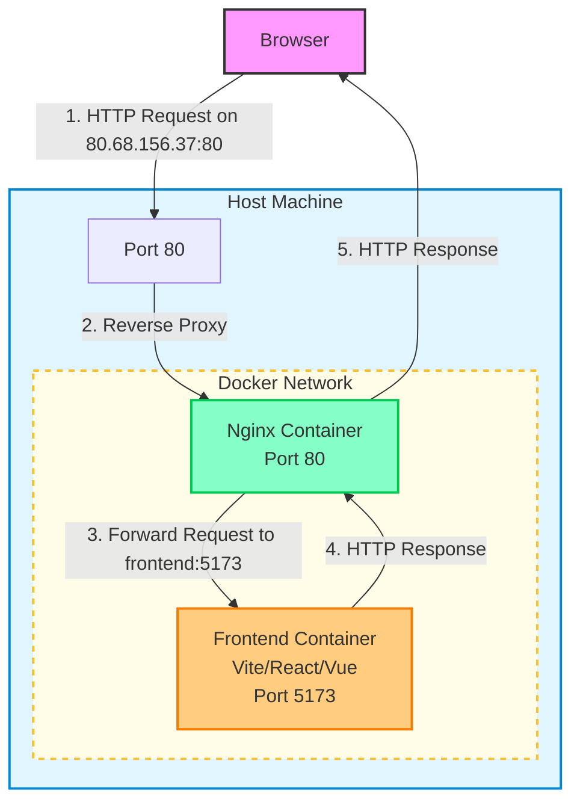

Это референсный бэкенд

# Cheatsheet

## Установить все нужные python библиотеки

```bash
uv sync
```


## Запустить веб-сервер (программа, обрабатывающая HTTP запросы)

```bash
uv run main.py
```

Однако чтобы всё работало у вас должен быть запущен PostgreSQL, и 
веб-сервер должен быть способен у нему подключиться.

## Запустить миграции, ещё не применённые к базе данных

```bash
uv run alembic upgrade head
```

## Сгенерировать новую миграцию исходя из состояния БД и моделей в коде

```bash
uv run alembic revision -m "Migration name" --autogenerate 
```

## Запустить тесты

```bash
uv run pytest tests
```

Примечание: при этом pytest сам возьмём оттуда все файлы которые начинаются с 
`test`, например `test_users.py`, и соберёт с них все функции которые 
начинаются с `test`, например `test_registration`.


# Технологический стек

* Uvicorn
* FastAPI
* SQLAlchemy (ORM)
* Asyncpg
* PostgreSQL
* Alembic

# Предметная область


Интернет-магазин.

Есть доступные товары.  Есть пользователи, у каждого пользователя есть корзина.

Какие взаимодействия поддерживаются:
* Регистрация пользователя
* Получение списка товаров
* Добавление товара в корзину (разрешено только владельцу корзины)

# Структура исходного кода

Маршруты FastAPI находятся в папке `routes` разделены по смыслу на относящиеся к
1. Пользователям
2. Корзинам
3. Товарам

Схемы API разделены так же, находятся в `schemas`.

В названии классов схем сначала указывается модель о которой говорим (например User), затем контекст в котором мы используем эту модель (например Create или Response).

Модели SQLAlchemy находятся в `models`.

# Схема работы сервисов (кроме бд)

```mermaid
flowchart LR
    %% КЛИЕНТСКАЯ ЧАСТЬ
    subgraph Client["Клиентская машина"]
        direction TB
        subgraph Browser["Браузер"]
            direction TB
            UI["Пользовательский интерфейс"]
            Fetch["fetch() / API-запросы"]
            HTTPRequest["Формирование HTTP-запроса"]

            UI --> Fetch
            Fetch --> HTTPRequest
        end
    end

    %% СЕТЬ И ХОСТ
    HTTPNetwork["Внешняя Сеть (Интернет)"]

    subgraph Host["Хост-машина (lab-frontend.mymaterials.ru)"]
        direction TB
        
        Port80["Порт 80 (HTTP)"]
        Port443["Порт 443 (HTTPS)"]

        subgraph DockerNet["Сеть Docker-compose"]
            direction LR

            %% Сервис gateway (Nginx)
            subgraph GatewayService["Сервис: gateway (Nginx)"]
                Nginx["Nginx Reverse Proxy<br/>+ SSL (Let's Encrypt)"]
            end

            %% Сервис frontend
            subgraph FrontendService["Сервис: frontend"]
                Frontend["Vite / React / Vue<br/>(Порт 5173)"]
            end

            %% Сервис web-server
            subgraph WebServerService["Сервис: web-server"]
                direction TB
                subgraph PythonProcess["Python-процесс"]
                    direction TB
                    Uvicorn["Uvicorn<br/>(uv run main.py:8000)"]
                    FastAPI["FastAPI / Router"]
                    Handler["Обработчик"]
                    SQLAlchemy["SQLAlchemy"]
                    AsyncPG["asyncpg"]

                    Uvicorn --> FastAPI
                    FastAPI --> Handler
                    Handler --> SQLAlchemy
                    SQLAlchemy --> AsyncPG
                end
            end

            %% Сервис postgres
            subgraph PostgresService["Сервис: postgres"]
                direction TB
                subgraph PostgreSQL["PostgreSQL 18"]
                    direction TB
                    Connection["Приём подключения"]
                    SQLExecution["Выполнение SQL"]
                    SharedBuffers["Буферный кэш"]
                    WALBuffer["WAL Buffer"]

                    Connection --> SQLExecution
                    SQLExecution <--> SharedBuffers
                    SQLExecution --> WALBuffer
                end
            end
        end

        %% Хранилище хоста
        subgraph HostDisk["Диск Хоста (Volumes)"]
            direction TB
            WALFiles["Файлы WAL"]
            DataFiles["Файлы таблиц"]
        end
    end

    %% МАРШРУТИЗАЦИЯ И ПОТОКИ (ТРАФИК)

    %% 1. Поток HTTP (Редирект)
    HTTPRequest -->|"1. Запрос на HTTP (:80)"| HTTPNetwork
    HTTPNetwork --> Port80
    Port80 --> GatewayService
    Nginx -->|"2. Редирект 301 (HTTPS)"| Port80
    Port80 -.-> HTTPNetwork

    %% 2. Основной поток HTTPS (:443)
    HTTPRequest -->|"3. Безопасный запрос (:443)"| HTTPNetwork
    HTTPNetwork --> Port443
    Port443 --> GatewayService

    %% Разделение внутри Nginx по путям (Location)
    Nginx -->|"4а. Маршрут '/'<br/>прокси к фронту"| Frontend
    Nginx -->|"4б. Маршрут '/api/'<br/>прокси к бэкенду"| Uvicorn

    %% 3. Работа с Базой Данных
    AsyncPG -->|"5. SQL-запрос к 'postgres:5432'"| Connection
    WALBuffer -->|"Запись при COMMIT"| WALFiles
    SharedBuffers -.->|"Checkpoint"| DataFiles

    %% ОБРАТНЫЙ ПОТОК (ОТВЕТЫ)
    SQLExecution -.->|"6. Результат SQL"| AsyncPG
    AsyncPG -.-> SQLAlchemy
    SQLAlchemy -.-> Handler
    Handler -.-> FastAPI
    FastAPI -.-> Uvicorn
    
    %% Ответы собираются в Nginx и отдаются клиенту
    Frontend -.->|"7а. Статика / Ответ"| Nginx
    Uvicorn -.->|"7б. JSON Ответ"| Nginx
    
    Nginx -.->|"8. HTTPS-ответ"| Port443
    Port443 -.-> HTTPNetwork
    HTTPNetwork -.-> Fetch
    Fetch -.-> UI

    %% СТИЛИЗАЦИЯ
    style Client fill:#f9f,stroke:#333,stroke-width:1px
    style Host fill:#e1f5fe,stroke:#0288d1,stroke-width:2px
    style DockerNet fill:#fffde7,stroke:#fbc02d,stroke-width:1px,stroke-dasharray: 5 5
    style GatewayService fill:#85ffc7,stroke:#00c853,stroke-width:2px
    style FrontendService fill:#ffcc80,stroke:#f57c00,stroke-width:1px
    style WebServerService fill:#e0f7fa,stroke:#00acc1,stroke-width:1px
    style PostgresService fill:#ede7f6,stroke:#5e35b1,stroke-width:1px

```






Чтобы развернуть надо
1. Чтобы были установлены git, docker, snapd (ещё один пакетный менеджер в добавок к apt, нужен для установки certbot), certbot (snap-пакет)
2. Чтобы на сервер был склонирован ваш проект
3. Чтобы проект был правильно настроен (compose.yaml, nginx.conf и так далее. Можете посмотреть как это сделано в референсном проекте)
4. Чтобы были выданы и подключены к nginx-контейнеру сертификаты (их можно получить через установленный certbot)
